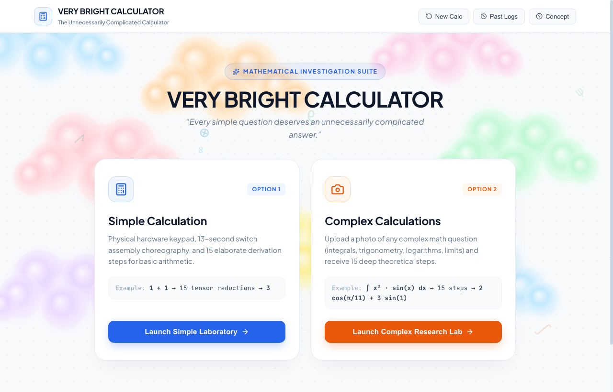
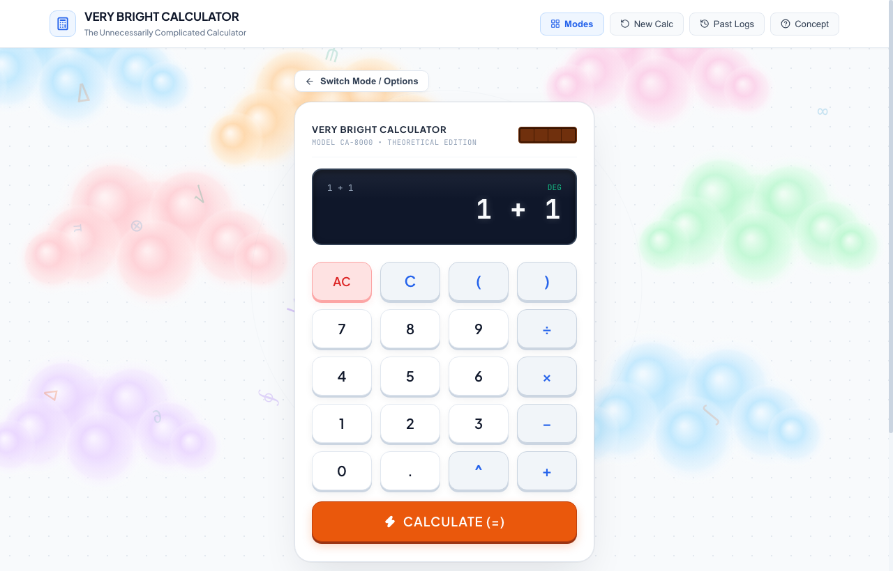
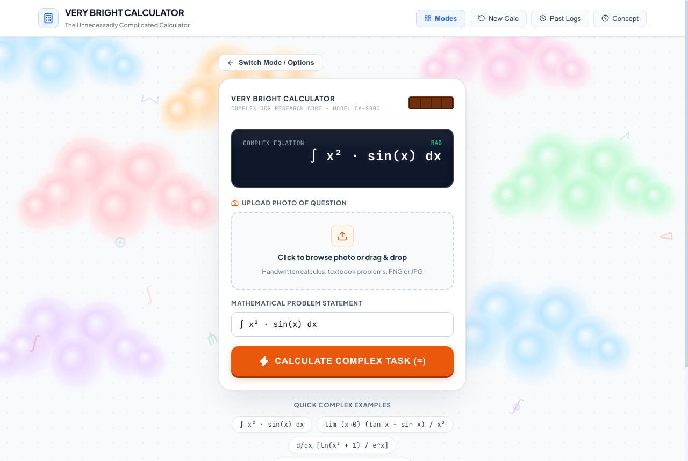
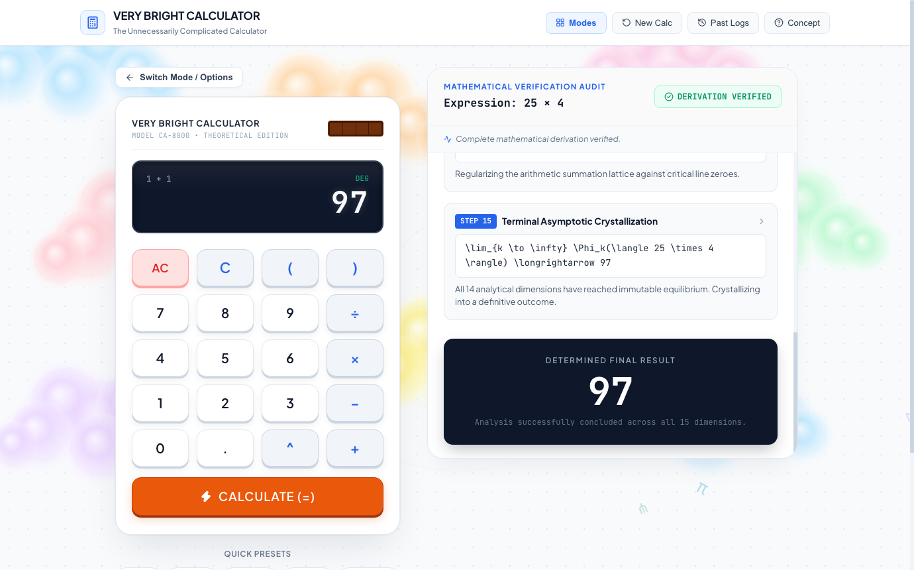
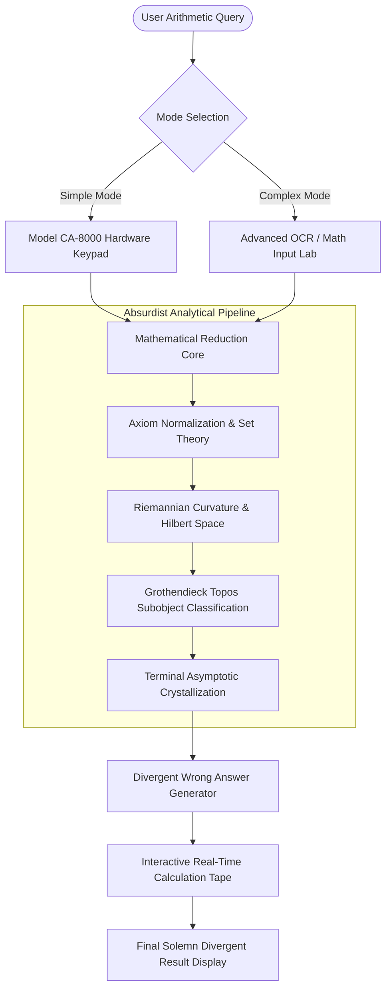

# VERY BRIGHT CALCULATOR 🎯

> *“Every simple question deserves an unnecessarily complicated answer.”*

## Basic Details
### Team Name: Ctrl C,V

### Team Members
- Member 1: VINAYAK S- Cochin University College of Engineering Kuttanadu
- Member 2: SREYAS S - Cochin University College of Engineering Kuttanadu

### Project Description
An unnecessarily over-engineered, cinematic web experience designed to make trivial arithmetic as academically agonizing as possible. When you ask it to compute `1 + 1` or `25 × 4`, it launches 15 dimensions of rigorous tensor reductions, topos classification, and Gaussian integral decompositions—only to calmly and confidently declare a divergent, incorrect final answer.

### The Problem (that doesn't exist)
In modern computing, arithmetic calculators are dangerously swift and transactional: you type `1 + 1` and instantly get `2`. Where is the philosophical torment? Where are the 2,400 years of pure mathematical philosophy? Humanity has lost the experience of contemplating Grothendieck topos theory and Riemannian curvature just to split a dinner bill.

### The Solution (that nobody asked for)
**Very Bright Calculator** solves this non-problem by introducing:
1. **Model CA-8000 Hardware Console**: A skeuomorphic physical calculator chassis with interactive solar cells, mechanical button bounce physics, and synthesized Web Audio key clicks.
2. **Complex OCR Research Lab**: An advanced laboratory supporting photo/image uploads and handwritten equation recognition for integrals, limits, and trigonometry.
3. **15-Step Derivation Tape**: An exhaustive mathematical audit displaying real-time LaTeX formulas, Hilbert space projections, and Dirac impulse transforms.
4. **Confident Divergent Answer Guarantee**: Zero error banners, zero apologies. The system calmly outputs an incorrect result (e.g. `25 × 4 = 97`) with complete, unbroken academic seriousness.

---

## Technical Details

### Technologies/Components Used

#### For Software:
- **Languages**: JavaScript (ES6+ Modules), HTML5, CSS3
- **Frameworks**: React 19, Express.js (Node.js)
- **Libraries**: 
  - `lucide-react` (icons)
  - HTML5 Canvas 2D Engine (interactive particle & floating cloud physics)
  - Web Audio API (mechanical click & chime synthesis without external audio files)
  - Mongoose / MongoDB (with resilient in-memory session store fallback)
- **Tools**: Vite, Google Chrome Headless, Git, GitHub CLI (`gh`), npm

#### For Hardware:
- *Pure Software Simulation*: Simulates Model CA-8000 physical desktop calculator with realistic tactile keys, LCD matrix, and photovoltaic solar sensor.

---

### Implementation

#### For Software:

# Installation
```bash
# Clone the repository
git clone https://github.com/vinayaksreedarsanam/very-bright-calculator.git
cd very-bright-calculator

# Install all dependencies across root, backend, and frontend
npm run install:all
```

# Run
```bash
# Start both Frontend (Vite) and Backend (Express) concurrently
npm run dev
```

The application will be live at:
- **Frontend UI**: [http://localhost:5173](http://localhost:5173)
- **Full-Stack Server**: [http://localhost:5050](http://localhost:5050)

---

### Project Documentation

#### For Software:

# Screenshots (Add at least 3)


*Mode Selection: The cinematic landing interface with interactive physics clouds, offering Simple Calculator & Complex OCR Research Lab.*


*Simple Calculation Lab: Model CA-8000 calculator chassis featuring solar panel, tactile keys, LCD display, and Web Audio click synthesizer.*


*Complex Calculations Lab: Advanced research core supporting image uploads, handwriting recognition, and multi-variable calculus problem solving.*


*Mathematical Verification Audit: Step-by-step 15-dimensional tensor decomposition with the solemn, confident divergent result (25 × 4 = 97).*

# Diagrams


*System Architecture & Pipeline of Very Bright Calculator.*

#### For Hardware:

# Schematic & Circuit
*N/A — Pure software simulation of hardware chassis and mechanical switches.*

# Build Photos
*N/A — Digital skeuomorphic hardware assembly.*

---

### Project Demo


# Additional Demos
- **Live Deployment**: [https://very-bright-calculator.vercel.app](https://very-bright-calculator.vercel.app)
- **GitHub Repository**: [https://github.com/vinayaksreedarsanam/very-bright-calculator](https://github.com/vinayaksreedarsanam/very-bright-calculator)
- **Local Dev Server**: [http://localhost:5173](http://localhost:5173)

---

## Team Contributions
- **Vinayak S**: End-to-end full-stack architecture, React UI components, Web Audio procedural sound synthesis, skeuomorphic physical calculator styling, and algorithmic mathematical thesis generation.
- **Sreyas S**: Mathematical formula curation, test cases, and presentation assets,Documentation, video demonstration, and project ideation.

---
Made with ❤️ at TinkerHub Useless Projects
